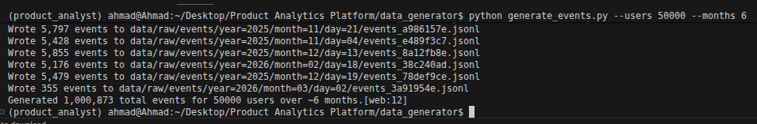
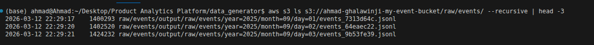
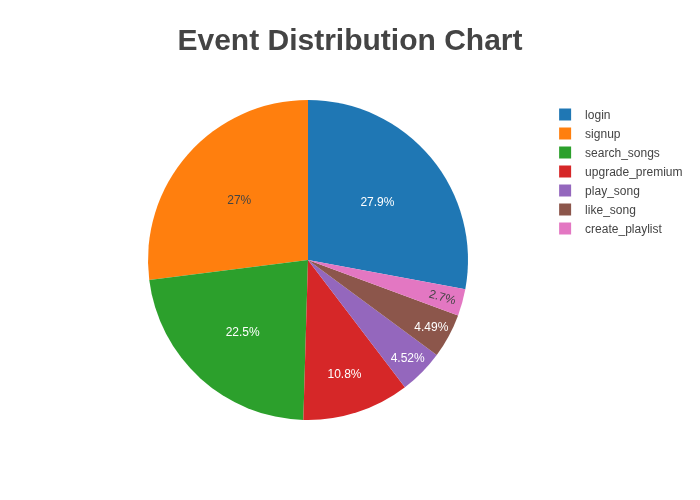
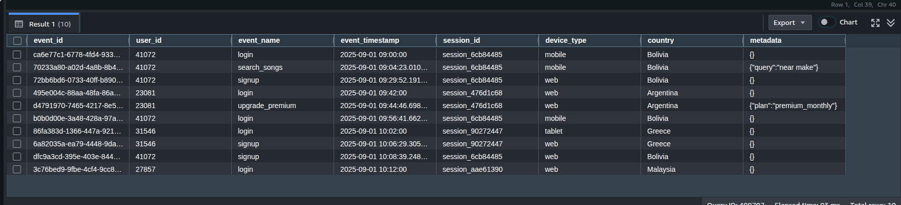
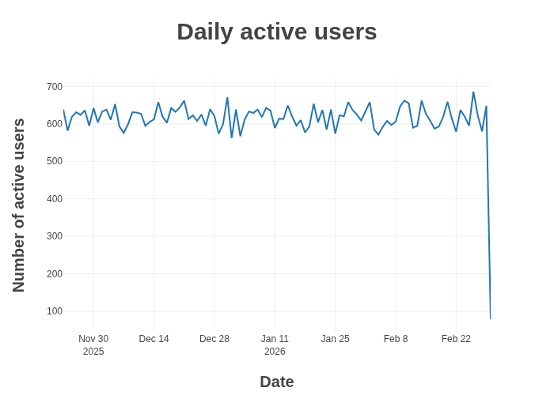

# 🎵 Product Analytics Platform

**1M+ Event Music Streaming Pipeline** | AWS S3 → Redshift

[](data_generator/architecture.png)

## 📊 Progress
| Stage | Status | Scale |
|-------|--------|-------|
| Data Generation | ✅ | 1M+ events |
| S3 Data Lake | ✅ | 182 files |
| Redshift RAW | ✅ | `raw_data.events` |

## 🚀 Quickstart
```bash
cd data_generator
pip install -r requirements.txt
python generate_events.py --users 50000 --months 6
python upload_to_s3.py ./data ahmad-ghalawinji-my-event-bucket
cd ../redshift && psql -f setup.sql


📁 Structure
├── data_generator/
│   ├── generate_events.py
│   ├── upload_to_s3.py
│   ├── data/
│   ├── README.md
│   └── requirements.txt
├── redshift/
│   ├── setup.sql
│   ├── validation.sql
│   └── marts/
├── screenshots/
│   ├── Data Generator Terminal.png
│   ├── S3 Bucket Structure.png
│   ├── Event Distribution Chart.png
│   ├── Data Sample.png
│   └── Daily active users.png
└── README.md


📸 Screenshots
| Data Generator                                                      | S3 Structure                                                | Event Distribution                                                    | Data Sample                                 | DAU Trend                                                 |
| ------------------------------------------------------------------- | ----------------------------------------------------------- | --------------------------------------------------------------------- | ------------------------------------------- | --------------------------------------------------------- |
|  |  |  |  |  |


🛠️ Stack
Python + Faker
AWS S3 (partitioned)
Redshift (DISTKEY/SORTKEY)

